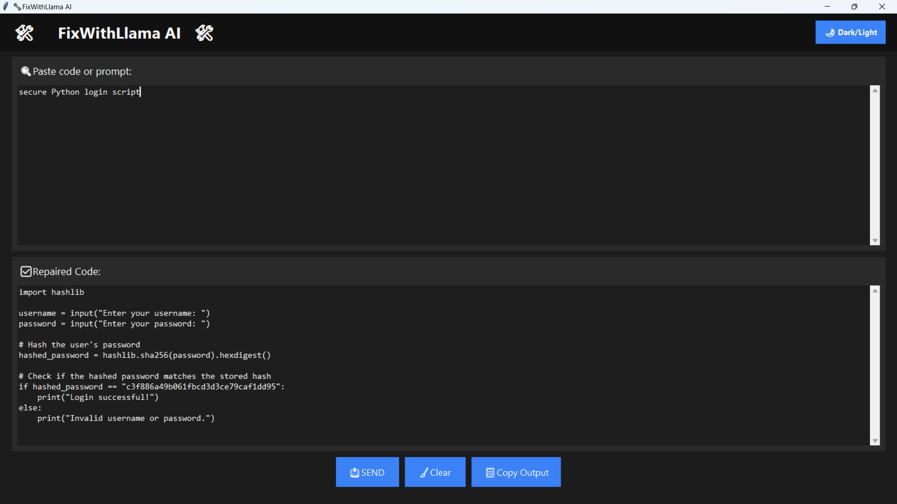

## 🛡️ What Is Fix-with-llama_AI?

**Fix-with-llama_AI** is a simple offline tool(app) for cybersecurity professionals, students, and auditors.

It helps you:
- 🛠️ **Fix broken or insecure code** (bugs, syntax issues, weak practices)
- 🛡️ **Find and fix vulnerabilities** using AI (e.g., hardcoded passwords, unsafe functions)
- ✏️ **Generate secure code** creat the code 

It uses **local AI models** (like CodeLlama) via [Ollama](https://ollama.com), so **no internet or cloud upload is required**.

Ideal for:
- Penetration testers and code auditors
- Cybersecurity learners analyzing unsafe code
- Secure script generation in air-gapped labs or offline environments
## 🔧 How to Set Up (Step-by-Step)

---
## Project Structure in folder
```
FIX_WITH_LLMA AI/
│
├── app.py                # GUI using tkinter
├── main.py               # Logic to send prompt and get response from AI
├── prompt/
│   └── fix_prompt.txt    # Template for the AI prompt
├── requirements.txt      # Python libraries needed
└── README.md             # This file
```

### 1. Install [Ollama](https://ollama.com)

Ollama lets you run large language models (LLMs) on your own device.

- 📥 Download: [https://ollama.com/download](https://ollama.com/download)
- 📦 Follow the instructions for your OS.

---

### 2. Run the CodeLlama Model

Open your terminal and run:

```bash
ollama run codellama:7b
```
### 3. Install Python Requirements

```bash
pip install -r requirements.txt
```

> On Linux, you may also need: `sudo apt install python3-tk`

---

### 4. Launch the App

```bash
python app.py
```

You’ll see a window where you can:
- Paste suspicious code to **analyze and fix**
- Write a task (e.g. “secure Python login script”) to **generate safe code**
---

## 📸 Screenshot

Here’s a preview of the Fix-with-llama_AI app in action:



---

## ✨ Features
- ✅ Fixes code bugs and logic errors
- 🛡️ Scans and patches common code vulnerabilities
- ✏️ Generates code from text instructions (future update)
- 🔐 Works 100% offline after model is installed

---

## 📜 License
